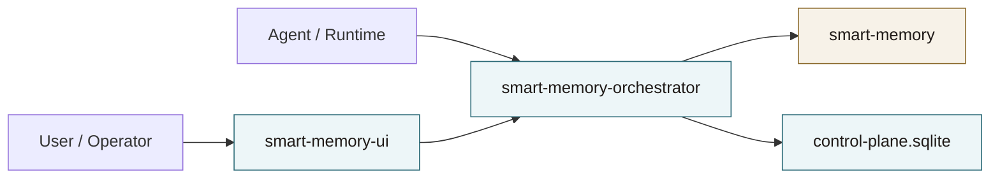

# Smart Memory Companion

Smart Memory Companion is the control-plane and inspection layer for [Smart Memory](https://github.com/BluePointDigital/smart-memory).

It does not replace Smart Memory. Smart Memory remains the canonical substrate for:

- transcripts
- derived memories
- evidence chains
- revision and supersession state
- lanes and working memory state
- rebuildability

This repo adds the companion layer on top:

- `smart-memory-orchestrator`
  A local TypeScript control-plane service that talks to Smart Memory over HTTP only.
- `smart-memory-ui`
  A React inspection UI that talks only to the orchestrator.
- `scripts/`
  Root launch, build, test, doctor, and packaging commands.

## Architecture



## Repository Layout

```text
smart-memory-companion/
  README.md
  SKILLS.md
  package.json
  .gitignore
  docs/
    architecture.md
    compatibility.md
    deployment.md
    operator-guide.md
  scripts/
    launcher.mjs
    build.mjs
    test.mjs
    doctor.mjs
    package-release.mjs
    lib/
  smart-memory-orchestrator/
  smart-memory-ui/
```

## Relationship To Smart Memory

Recommended local checkout shape:

```text
workspace/
  smart-memory/
  smart-memory-companion/
```

The companion resolves Smart Memory in this order:

1. `SMART_MEMORY_PROJECT_ROOT`
2. local `./smart-memory` inside this repo
3. sibling `../smart-memory`

That keeps the repos separate while making local development simple.

## Runtime Model

- Development mode:
  - Smart Memory
  - orchestrator dev server
  - Vite UI dev server
- App mode:
  - Smart Memory
  - orchestrator serving the built UI at `/`

Normal runtime path:

`agent -> orchestrator -> Smart Memory`

Normal UI path:

`browser -> UI -> orchestrator -> Smart Memory`

## Quick Start

### Prerequisites

- Node.js 20+
- a working local Smart Memory checkout
- Smart Memory Python virtualenv ready inside that checkout

### Install

```powershell
cd smart-memory-orchestrator
npm install

cd ..\smart-memory-ui
npm install
```

If Smart Memory is not checked out next to this repo, set:

```powershell
$env:SMART_MEMORY_PROJECT_ROOT="D:\path\to\smart-memory"
```

### Verify

```powershell
npm run doctor
```

### Run

```powershell
npm run dev
```

or for the smoother local app mode:

```powershell
npm run app
```

## Root Commands

- `npm run dev`
  Starts Smart Memory, orchestrator watch mode, and the Vite UI.
- `npm run app`
  Builds the repo, starts Smart Memory, and starts the orchestrator with static UI serving.
- `npm run build`
  Exports OpenAPI, regenerates UI API types, builds orchestrator, builds UI.
- `npm run test`
  Runs launcher tests, orchestrator tests, OpenAPI export, UI API generation, and UI tests.
- `npm run doctor`
  Checks Node, dependency layout, Smart Memory pathing, ports, and health endpoints.
- `npm run package:release`
  Creates a clean release staging directory under `artifacts/`.

## Stable API Surface

The stable agent-facing routes are:

- `POST /api/runtime/context`
- `POST /api/runtime/ingest/turn`
- `POST /api/runtime/ingest/message`

The inspection and operator routes include:

- `GET /api/system/status`
- `GET /api/capabilities`
- `GET /api/runs`
- `GET /api/transcripts/sessions`
- `GET /api/memories`
- rebuild and lane action routes

## UI Overview

- Runs & Workspace
  Power form for orchestration requests, run history, workspace bundles, framing policy, traces, and adapter payloads.
- Transcripts
  Known session list, manual lookup, transcript detail, and evidence-linked memory jumps.
- Memory
  Filtered memory browsing, evidence, revision chain, history, and lane actions.
- Rebuild & Debug
  Status, capability visibility, guarded rebuild actions, and raw result inspection.

## Versioning And Compatibility

The companion is versioned independently from Smart Memory core.

Compatibility expectations live in [docs/compatibility.md](docs/compatibility.md).

## Deployment And Distribution

Deployment notes and release packaging expectations live in [docs/deployment.md](docs/deployment.md).

## Operator Guidance

Daily operational guidance lives in [docs/operator-guide.md](docs/operator-guide.md).

## Development Notes

- The UI must only talk to the orchestrator.
- The orchestrator must only talk to Smart Memory over HTTP.
- Do not move companion logic into Smart Memory core by default.
- Keep the orchestrator opinionated in stages, contracts, and traces, but extensible through hooks and runtime adapters.

## Troubleshooting

- If `doctor` fails Smart Memory path checks, set `SMART_MEMORY_PROJECT_ROOT`.
- If `doctor` fails health checks, the services may simply not be running yet.
- If `app` mode reports static UI problems, run `npm run build`.
- If the transcript list is empty, use manual session lookup or run a companion-managed ingest/workspace assembly first.

## GitHub Workflows

This repo includes:

- CI workflow for install, build, and test
- release workflow for tag-based packaging and GitHub Release uploads

See `.github/workflows/`.
