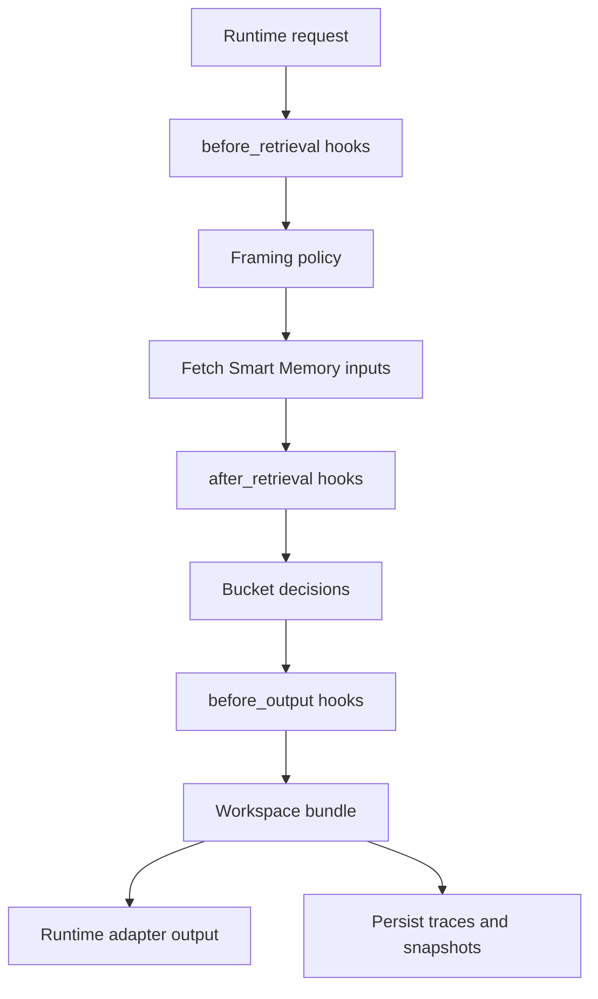

# Architecture

## Core split

- `smart-memory`
  Canonical cognitive data plane.
- `smart-memory-orchestrator`
  Companion control plane.
- `smart-memory-ui`
  Companion inspection and operator surface.

## Ownership

Smart Memory owns:

- transcripts as canonical truth
- derived memories
- evidence links
- revision, supersession, and expiry
- lane state
- retrieval primitives
- rebuild behavior

The orchestrator owns:

- request framing
- context policy
- hook execution
- retrieval shaping
- workspace assembly
- runtime adapter output
- run traces and debug snapshots

The UI owns:

- operator inspection
- trace visibility
- rebuild controls
- workflow debugging

## Control-plane flow

## API boundary

- The orchestrator talks to Smart Memory over HTTP only.
- The UI talks to the orchestrator only.
- Agents should use `/api/runtime/*` for normal operation.

## Persistence boundary

The orchestrator SQLite store is not canonical memory truth. It exists only for:

- run traces
- workspace snapshots
- hook and stage timing
- runtime output previews
- known session indexing
